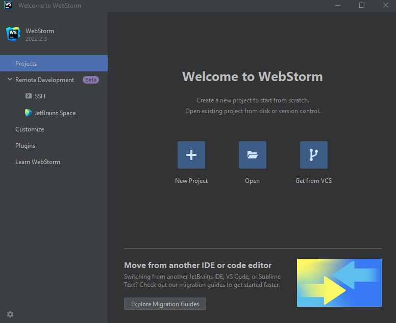
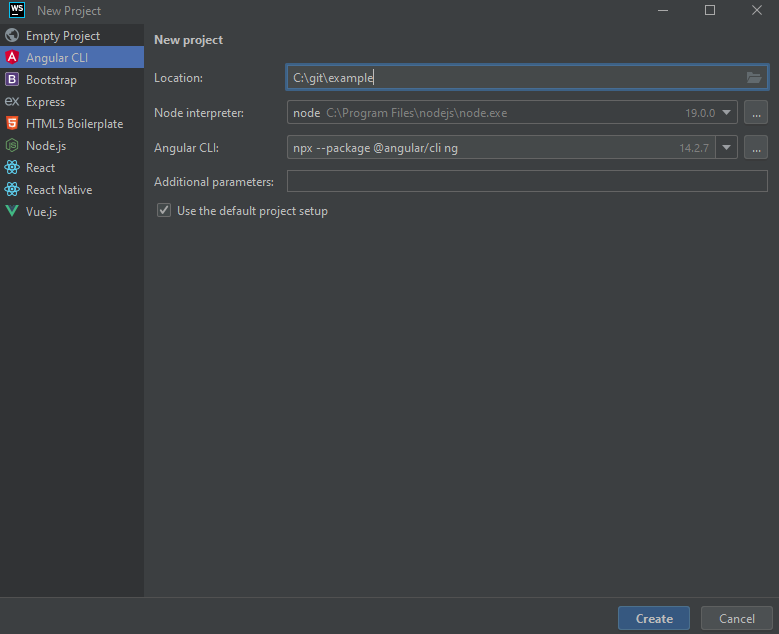
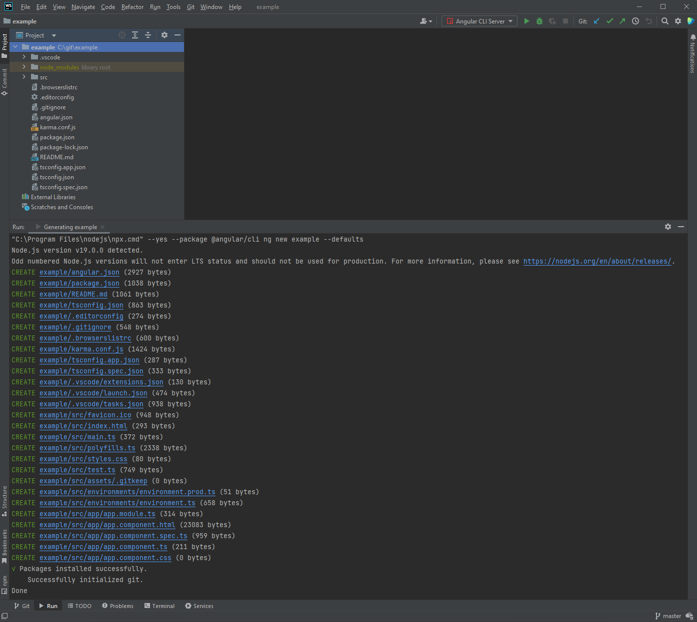
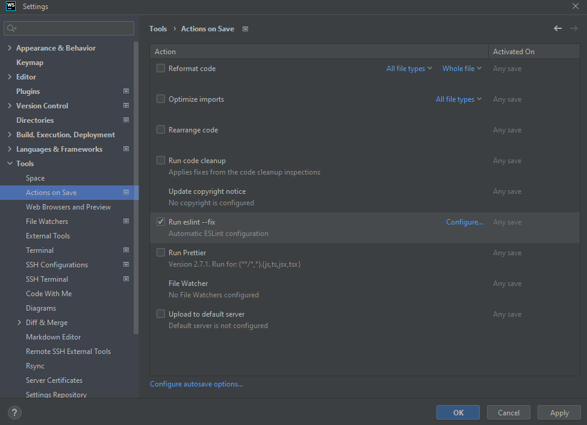

# Getting Started

Starting fast a new Angular project with code formatter, good code quality, good commit message, tests and responsive design.

## Prerequisites

### Node.js and NPM

Download and install Node.js and NPM from [https://nodejs.org/en/download](https://nodejs.org/en/download).

### Git

Download and install git for Windows from [https://git-scm.com](https://git-scm.com).

Verify your install with `git -v`.

Configure git with your username, your email address and prevent warning if you are using only Windows for this project (End Of Line characters).

```shell
git config --global user.name "John Doe"
git config --global user.email johndoe@example.com
git config --global core.autocrlf false
```

### WebStorm (IDE)

Download and install WebStorm an Integrated Development Environment from [https://www.jetbrains.com/webstorm/download/](https://www.jetbrains.com/webstorm/download/).

## Create the Angular project with WebStorm

Open WebStorm and click on "New Project".



Add a name of your project and click on "Create".



Wait for the creation of the new project.



## Add dependencies to improve code quality, code formatting, tests and design

### Angular Material

Add Angular Material to the project.

```shell
ng add @angular/material
```

### ESLint

Add ESLint to the project.

```shell
ng add @angular-eslint/schematics
```

### Prettier

Add Prettier to the project.

```shell
npm install --save-dev prettier eslint-config-prettier eslint-plugin-prettier
```

Then, in your `.eslintrc.json` file add:

```json
"extends": [
  "plugin:@angular-eslint/recommended",
  "plugin:@angular-eslint/template/process-inline-templates",
  "plugin:prettier/recommended"
],
```

Then you need to add plugin:prettier/recommended as the last extension in your `.eslintrc.json`:

```json
"extends": [
  "plugin:@angular-eslint/template/recommended",
  "plugin:prettier/recommended"
],
```

Run the following command to add in the `package.json` a prettier command:

```shell
npm pkg set scripts.format='prettier --write \""/**/*\""'
```

WebStorm settings - Actions on save



Add Fix Lint and Prettier errors command in package.json

```shell
npm pkg set scripts.lint='ng lint --fix'
echo "" > .prettierignore
echo "" > .prettierrc
```

Add the ignored files in the `.prettierignore` file:

```text
e2e
node_modules
dist
.vscode
coverage
*.png
*.ico
src/assets

.idea
.husky
.angular
```

Add the ignored files in the `.prettierrc` file:

```text
{
  "singleQuote": true,
  "printWidth": 120,
  "overrides": [
    {
      "files": "*.html",
      "options": {
        "parser": "angular"
      }
    }
  ]
}
```

### Commitlint

Add commitlint to the project:

```shell
npm install --save-dev @commitlint/config-conventional @commitlint/cli
echo "module.exports = {extends: ['@commitlint/config-conventional']}" > commitlint.config.js
```

### Husky

Add lint-staged to the project:

```shell
npm install --save-dev lint-staged
echo "" > .lintstagedrc
```

Add to the `.lintstagesrc` file just created the following lines:

```json
{
  "*.{html,ts}": ["eslint"],
  "*.{css,scss,json,json5,md,js,ts,html}": ["prettier --check"]
}
```

Then, add husky to the project:

```shell
npm install --save-dev husky
npx husky install

npm pkg set scripts.prepare="husky install"
npx husky add .husky/pre-commit 'npx lint-staged'
npx husky add .husky/pre-push 'npm run test -- --no-watch --browsers=ChromeHeadlessCI'
npx husky add .husky/commit-msg  'npx --no -- commitlint --edit ${1}'
```

### Test

Add the following line in the file `karma.conf.js`:

```json
{
  "customLaunchers": {
    "ChromeHeadlessCI": {
      "base": "ChromeHeadless",
      "flags": ["--no-sandbox"]
    }
  }
}
```
